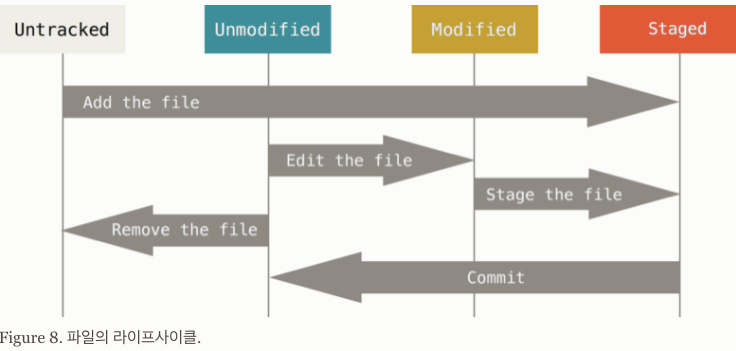

# Git에서 file의 개념적인 위치와 상태.

## 파일의 위치(conceptual location) : Working tree, Stage, Repsitory

Git 이 version 관리를 할 때, 다음과 같은 3가지의 파일이 놓이는 개념적인 공간 (file의 단계라고도 생각할 수 있음)이 존재함.

#### `Working Tree` (or Working Directory)
        
* 파일의 수정, 저장 등의 작업이 이루어지는 곳
* 일반적으로 프로젝트이 루트 디렉토리가 바로 working tree임.
            
#### `Stage`

* Version 관리가 될 파일들이 대기하게 되는 곳
* staging area라고 불림.
            
#### Repository
      
* Version이 할당되어 관리되는 파일들이 있는 곳. 
* Stage에 있던 파일들이 `commit`을 통해 repository로 이동됨.
            
            
file들 중에서 stage와 repository에 존재하는 file들이 실제로 `.git` 디렉토리에 저장이 되게 된다.

## File의 Life Cycle

Working directory의 파일은 크게 다음 2가지 상태의 파일로 나눌 수 있다.

* ***tracked file*** : version이 할당되어 관리 중 인 파일.
* ***untracked file*** : version이 할당되지 않아서 관리가 안 되고 있는 파일.

위의 ***Tracked file*** 은 다음의 3가지 상태로 나뉜다.

* ***unmodifed file*** : version이 관리가 되는 file이 해당 version의 상태 그대로인 경우.
* ***modifed file*** : version이 관리가 되는 file이 변경만 된 상태로 add를 통해 staged 상태로 넘어가기 전 상태임.
* ***staged file*** : version이 관리가 되는 file이 변경 후 add되어 commit되기 전 상태.

